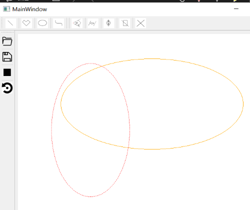
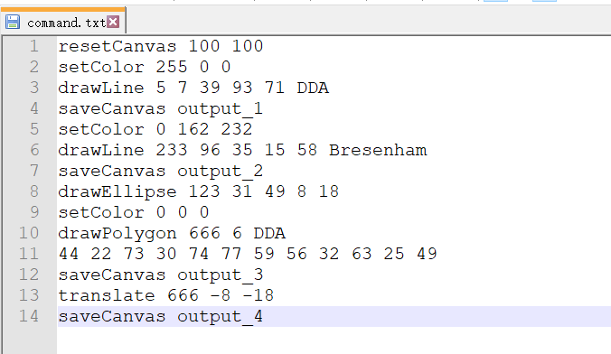

# 
图形学大作业系统使用说明书 

 171860525 陈善梁 

 171860525@smail.nju.edu.cn 

# 目录
## 一、[开发环境说明](#1)
## 二、[程序运行说明](#2)
## 三、[功能介绍](#3)
### 1. [命令行方式读取文件指令并执行](#31)
### 2. [重置画布](#32)
### 3. [保存画布](#33)
### 4. [设置画笔颜色](#34)
### 5. [画线段](#35)
### 6. [绘制多边形](#36)
### 7. [绘制椭圆](#37)
### 8. [平移图元](#38)
### 9. [缩放](#39)
### 10. [旋转](#310)
### 11. [线段裁剪](#311)
### 12. [绘制曲线](#312)
### 13. [从用户界面读取文件指令](#313)

 

## 一. 开发环境说明 
本项目是用C++编写，基于Qt 5.9.0 框架开发的。用Qt Creator 4.10.2编写全部代码。  
项目的编译套件是 Desktop (x86-windows-msvc2017-pe-64bit)。  
操作系统：windows10。

## 二. 程序运行说明 
在Qt Cteator中编译运行。进入程序界面。通过点击工具栏的图标、在弹出的对话框中输入数字、选择选项等方式进行绘图操作。窗口下方的状态栏对当前操作进行提示。

## 三. 功能介绍 
### 1. 命令行方式读取文件指令并执行:
在命令行窗口中进入exe文件所在的目录，执行exe程序，添加命令行参数为指令文件所在的路径以及bmp文件保存的文件夹路径:

程序执行完毕后,在命令行参数指定的图片输出文件夹中生成了图片结果：

###  2. 重置画布 
在窗口左侧工具栏的重置画布按钮，在对话框中输入框输入画布的宽和高(默认为700*700)，点击"OK"将创建对应尺寸的白底画布。  

###  3. 保存画布 
点击在窗口左上的“保存”按钮，选择保存位置，输入保存文件名称，点击OK。  
 

在文件资源管理器中找到并打开:  
  
###  4. 设置画笔颜色   
点击左侧工具栏的“调色”按钮(初始为黑色),进入调色板对话框，选择颜色，可以看到调色按钮已经变成了对应的颜色。

###  5. 画线段 
用户交互绘制线段时，采用使用Bresenham算法(更为精确)。按下上方工具栏“直线”按钮。在画布中左键点击（本项目中所有有效点击均为左键），选中起始点，按住不放，移动鼠标会显示实时线段，松开则决定终点，完成画线:    
###  6.绘制多边形 
按下上方工具栏“多边形”按钮，在对话框中选中算法(DDA或者Bresenham)并输入多边形边数n(n>=3)。在画布上点击n个点，选中的点以红色标出，完成n个后绘出多边形：  
  

###  7. 绘制椭圆 
点击上方工具栏“椭圆”按钮，在画布中点击选中椭圆所在矩形的一个顶点，按住移动鼠标，实时更新矩形并绘出椭圆，松开则完成绘制:  

###  8. 平移图元 
点击上方工具栏“平移”按钮，在画布内点击图元(点击处和图元像素距离2个像素点)，选中成功后图元会以红色虚线标出:  
   

按住不放，移动鼠标，该过程中图元会虚线显示并且实时移动，松开后移动完成。

###  9. 缩放 
点击“缩放”按钮，在画布内点击图元(点击处和图元像素距离2个像素点)，选中成功后图元会以红色虚线标出(同上)。再次左键点击选择缩放中心，用红色点标出：
  

选中后，鼠标滚轮上滑为放大，每上滑一格，当前放大0.2倍。下滑为缩小，每格缩小0.2。下面第一张为缩小为原来的0.6倍,第二张为放大至1.8倍(如果放大倍数太大，会导致超出画布以及较大内存损耗，甚至导致之后的交互操作卡顿。如果缩小得太小了，会导致控制点离得太近甚至重合，就无法通过放大复原了):

  
  

缩放完成后，鼠标左键单击画布即可退出当前图元的缩放，当前图元取消虚线显示，可继续选择下一个需要缩放的图元。单击取他按钮也可退出缩放。
  
###  10. 旋转 
点击“旋转”按钮，在画布内点击图元(点击处和图元像素距离2个像素点)，选中成功后图元会以红色虚线标出(同上)。再次左键点击选择旋转中心，用红色点标出：
  

左键单击画布，选择旋转的起始点，按住不放并拖动，终点不断改变，根据旋转中心、起始点、终点计算出旋转角度，实时更新当前旋转情况：
 

松开则结束旋转，图元恢复实线显示。可继续选择下一个需要旋转的图元。
###  11. 线段裁剪 
用户交互在裁剪线段时，采用更快速的梁友栋算法。点击"裁剪线段"，进入选择待裁剪图元的模式，点击要裁剪的线段（只有线段才能被裁剪），选中成功后图元会以红色虚线标出：

接下来进入选择裁剪矩形框的步骤，左键点击选择矩形的一个顶点，保持点击状态不要松开，移动鼠标，实时显示出当前矩形框形状：

松开后完成裁剪:

###  12. 绘制曲线 
点击上方"曲线"图标，在对话框内选择曲线绘制算法:Bezier或者B样条算法，输入曲线控制点的数量n（n >= 5）。在画布内左键单击n次选中n个控制点，完成后自动绘出对应的曲线，以下是n = 5绘制Bezier曲线的情况:

###  13. 从用户界面读取文件指令实现上述功能 
#### 注意事项:画多边形的指令必须分两行写，第二行为所有点的坐标。否则文本解析出错。
指令文件为:  
  

点击左侧工具栏"打开指令文件"按钮，选择指令文件，点击打开。执行文件中的指令。
  

 完成执行:  

## 

 四. gif展示
由于pdf不能显示gif,因此请助教打开pictures/gifs查看。
### 简单图元生成

### 平移

### 旋转

### 裁剪

### 缩放

### 保存
